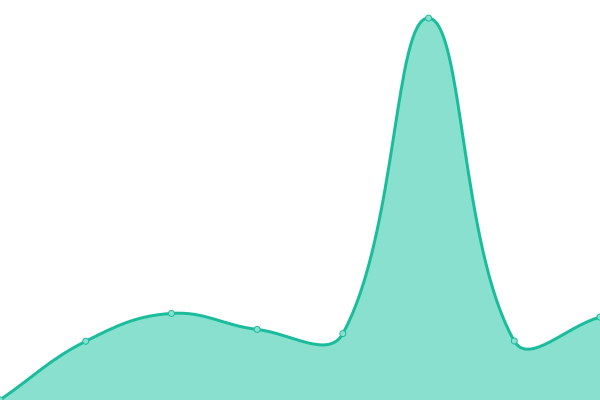
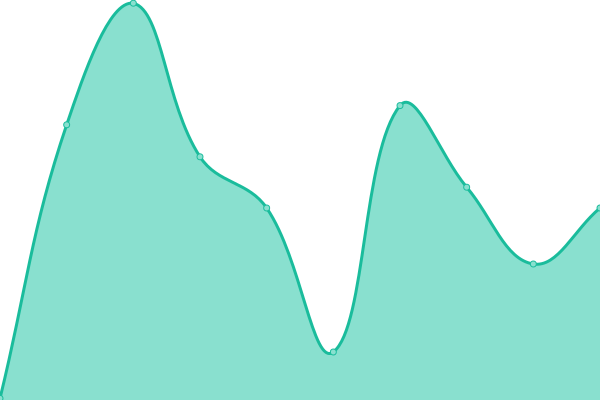

# [📈 Live Status](https://status.noko1024.net): <!--live status--> **🟧 Partial outage**

This repository contains the open-source uptime monitor and status page for [Yuhei Kobayashi](https://www.noko1024.net), powered by [Upptime](https://github.com/upptime/upptime).

With [Upptime](https://upptime.js.org), you can get your own unlimited and free uptime monitor and status page, powered entirely by a GitHub repository. We use [Issues](https://github.com/noko1024/upptime/issues) as incident reports, [Actions](https://github.com/noko1024/upptime/actions) as uptime monitors, and [Pages](https://status.noko1024.net) for the status page.

<!--start: status pages-->
<!-- This summary is generated by Upptime (https://github.com/upptime/upptime) -->
<!-- Do not edit this manually, your changes will be overwritten -->
<!-- prettier-ignore -->
| URL | Status | History | Response Time | Uptime |
| --- | ------ | ------- | ------------- | ------ |
|  [Misskey](https://mk.noko1024.net) | 🟥 Down | [misskey.yml](https://github.com/noko1024/upptime/commits/HEAD/history/misskey.yml) | 

 0ms
     
 | 

<a href="https://status.noko1024.net/history/misskey">0.00%</a>
    

|  [Emby](https://en.wikipedia.org) | 🟩 Up | [emby.yml](https://github.com/noko1024/upptime/commits/HEAD/history/emby.yml) | 

 197ms
     
 | 

<a href="https://status.noko1024.net/history/emby">100.00%</a>
    

|  nextcloud | 🟩 Up | [nextcloud.yml](https://github.com/noko1024/upptime/commits/HEAD/history/nextcloud.yml) | 

 1195ms
     
 | 

<a href="https://status.noko1024.net/history/nextcloud">100.00%</a>
    

|  [PaperMC](mc.noko1024.net) | 🟩 Up | [paper-mc.yml](https://github.com/noko1024/upptime/commits/HEAD/history/paper-mc.yml) | 

 169ms
     
 | 

<a href="https://status.noko1024.net/history/paper-mc">100.00%</a>
    

|  [global-wakahara](https://wp.global-wakahara.com) | 🟩 Up | [global-wakahara.yml](https://github.com/noko1024/upptime/commits/HEAD/history/global-wakahara.yml) | 

 1564ms
     
 | 

<a href="https://status.noko1024.net/history/global-wakahara">99.43%</a>
    

<!--end: status pages-->

[**Visit our status website →**](https://status.noko1024.net)

## 📄 License

- Powered by: [Upptime](https://github.com/upptime/upptime)
- Code: [MIT](./LICENSE) © [Yuhei Kobayashi](https://www.noko1024.net)
- Data in the `./history` directory: [Open Database License](https://opendatacommons.org/licenses/odbl/1-0/)
